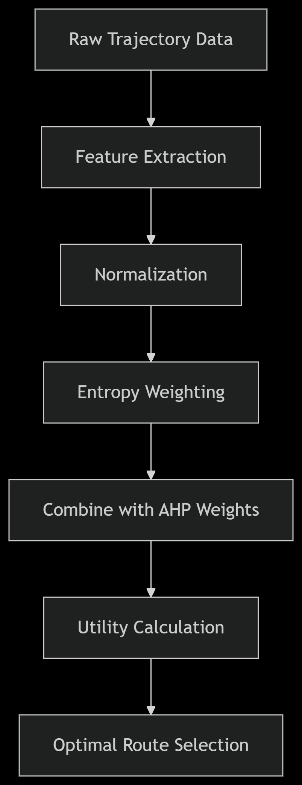

# Trajectory Optimization: Selecting the Optimal Route
## Project Overview

This project adapts a network selection algorithm from the research paper ***"A heterogeneous network selection algorithm for internet of vehicles based on comprehensive weight"*** to solve a trajectory optimization problem. While the original article focused on selecting optimal networks in IoV environments, this implementation creatively applies the same methodology **(AHP + entropy weighting)** to select optimal vehicle routes based on GPS trajectory data.

## Data Source
The implementation uses the [Geolife Trajectories 1.3 dataset](https://www.kaggle.com/datasets/marquis03/geolife-trajectories-1-3) from Microsoft Research Asia, which contains:
- 17,621 trajectories from 182 users
- Total distance of 1.2 million kilometers
- Total duration of 48,000+ hours
- Collected over 5 years (2007-2012)

## Key Features

### Novel Adaptation
- Transforms a network selection algorithm into a route optimization tool
- Adapts IoV network selection methodology to spatial trajectory analysis

### Data Processing
- Loads and processes standard GPS trajectory data from PLT files
- Handles large datasets with efficient batch processing
- Robust error handling for malformed GPS data

### Multi-Criteria Decision Making
Evaluates and compares routes based on three key metrics:
1. **Distance** (measured in kilometers)
2. **Duration** (calculated in hours)
3. **Average speed** (km/h)

### Hybrid Weighting System
- **Subjective weights**:
  - Uses Analytic Hierarchy Process (AHP) method
  - Incorporates user preferences through configurable weights
- **Objective weights**:
  - Data-driven approach using entropy method
  - Automatically adjusts based on actual trajectory characteristics

### Visualization Tools
- Generates clear utility score plots for route comparison
- Creates interactive Folium maps of optimal routes
- Visual outputs include:
  - Bar charts of route utilities
  - HTML maps with trajectory overlays


## Installation

1. Clone the repository:
   ```bash
   git clone https://github.com/yourusername/iov-route-optimization.git
   cd iov-route-optimization
2. Install required dependencies:
   ```bash
   pip install pandas numpy geopy folium matplotlib
3. Download the Geolife dataset:
   ```bash
   kaggle datasets download -d marquis03/         geolife-trajectories-1-3
   unzip geolife-trajectories-1-3.zip -d data/
## Usage

1. Prepare your trajectory data:
   - The code is pre-configured to work with the Geolife dataset structure

   - For custom data, organize PLT files in: ``/data/user_id/Trajectory/``

   - Update ``base_path`` in the script if using non-standard locations
2. Run the optimization:
   ```bash
   python main.py
3. Outputs:
   -Terminal displays:

    - Calculated objective weights

    - Combined global weights

     - Optimal route details

     - utility_scores.png: Bar chart of all route evaluations

     - optimal_trajectory_map.html : Interactive Folium map of best route
 ## Technical Approach
 ### Adaptation from Network to Route Selection
 While the original paper selected between network types (LTE, 5G, etc.), this implementation selects between route alternatives by:

1. Replacing network metrics with route metrics:

   - Original: Bandwidth, latency, cost

   - Adapted: Distance, duration, speed

2. Maintaining the core methodology:



## Customization Options
1. Adjust subjective preferences:
   ```bash 
   subjective_weights = np.array([0.4, 0.3, 0.3])  # Distance, Duration, Speed

2. Control objective-subjective balance:
   ```bash
   alpha = 0.5  #0 = fully objective, 1 = fully subjective
## Academic Basis
  This work adapts the hybrid weighting approach from:
 **"A heterogenous network selection algorithm for internet of vehicles based on comprehensive weight"**
### Key methodological adaptations:
  - Applied network selection logic to spatial route optimization

- Maintained AHP + entropy fusion framework

- Replaced network QoS parameters with route characteristics

- Validated using real-world trajectory data from Geolife dataset

# 🤝 How to Contribute
Contributions are welcome! To suggest improvements:

1. Fork this repository.

2. Create a branch (git checkout -b feature/improvement).

3. Commit your changes (git commit -am 'Add an improvement').

4. Push to the branch (git push origin feature/improvement).

5. Open a pull request.

## Specific Areas Needing Contributions
- Algorithm Improvements:

- Implement real-time optimization capabilities

- Add support for additional trajectory metrics

- Visualization:
  - Enhance the Folium maps with more interactive elements

  - Create comparative visualization tools

- Documentation:

   - Improve code comments and docstrings

    - Add usage examples for different scenarios


# License
Distributed under the MIT License. See [LICENSE](./LICENSE) for more information.
